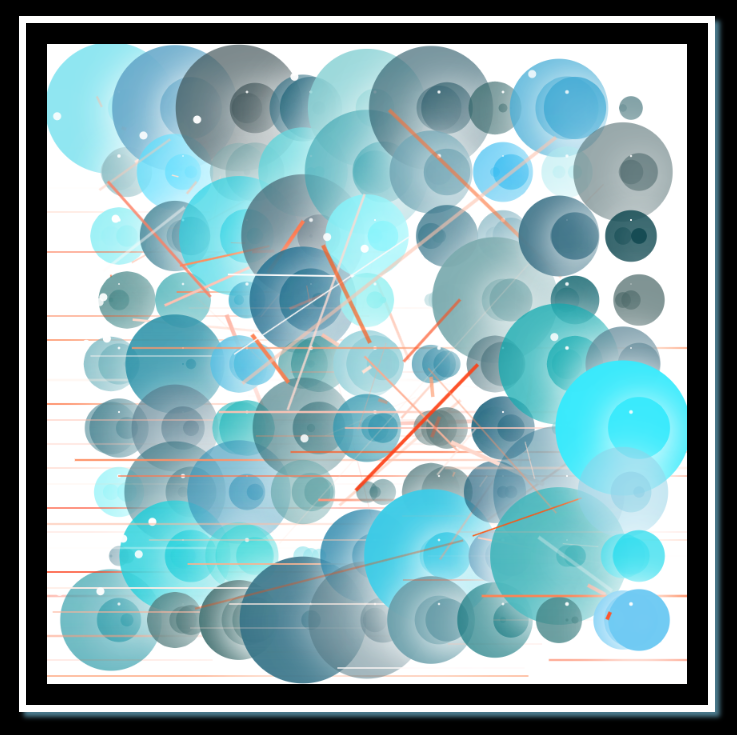

# Canvas Sketch / 1513148

[Kodluyoruz](https://www.kodluyoruz.org) The first repository I created in the Front-End tutorial.




## Installation

Firstly [clone](https://github.com/bedirxanugur) the project. 

```bash
git clone git@github.com:bedirxanugur/sketch1534271.git
```

## Usage

After you clone the project, open it in Visual Studio Code.
***
for Linux:
```linux
cd sketch1534271
code .
```

## Contributing
Pull requests are accepted. For major changes, please open a thread to discuss what you want to change first.


## License
[MIT](https://choosealicense.com/licenses/mit/)